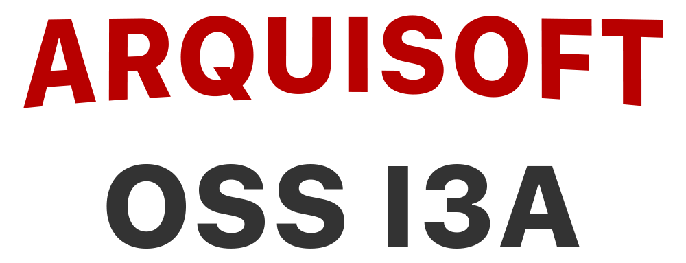
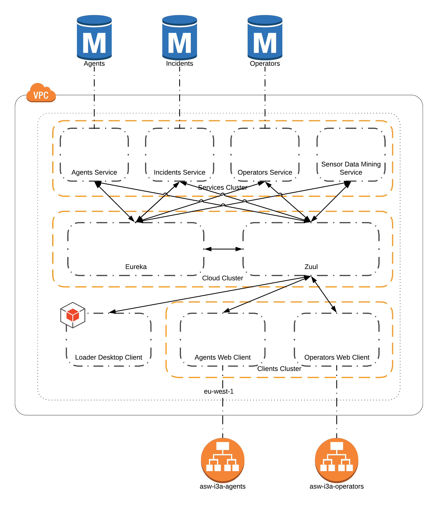

<!-- Do  not touch anything bellow this line -->

| **Component** | **Continous Integration** | **Code Coverage** | **Code Quality** | **Endpoint**
|---|:---:|:---:|:---:|:---:|
|**[agents service](https://github.com/asw-i3a/agents-service)**        ||||
|**[operators service](https://github.com/asw-i3a/operators-service)** ||||
|**[incidents service](https://github.com/asw-i3a/incidents-service)** ||||
|**[sensor data mining service](https://github.com/asw-i3a/sensor-data-mining)** ||||-
|**[agents desktop client](https://github.com/asw-i3a/agents-desktop-client)** ||||-
|**[agents web client](https://github.com/asw-i3a/agents-web-client)** ||||[AWS](http://asw-i3a-agents-client.guill.io)
|**[operators web client](https://github.com/asw-i3a/operators-web-client)** ||||[AWS](http://asw-i3a-operators-client.guill.io)

<!-- Do  not touch anything above this line -->

## System description
This is an incident management system based on pure micro-services. That is, we provide a fully functional API with services that allows clients to interact with the system elements. Besides the API is fully functional by itself we also provide three clients to visually interact with the system.

The API is composed by agents-service, operators-service, incidents-service and sensor-data-mining-service. Clients are: agents-dektop-client, agents-web-client and operators-web-client.

Each one of the modules that composes system it is fully sxplained in its own readme file. Here you will learn how the composition of the system is done and how to deploy the system to a fully functional production environment.

## Most important technologies used

### Java
Java is a general-purpose computer-programming language that is concurrent, class-based, object-oriented, and specifically designed to have as few implementation dependencies as possible. It is intended to let application developers "write once, run anywhere" (WORA), meaning that compiled Java code can run on all platforms that support Java without the need for recompilation.

**How we use it:**
We use java as our main languaje to develop the project. Every module, service and client for this project has been written in java.

### Spring boot
Spring Boot makes it easy to create stand-alone, production-grade Spring based Applications that you can "just run". We take an opinionated view of the Spring platform and third-party libraries so you can get started with minimum fuss. Most Spring Boot applications need very little Spring configuration.

**How we use it:**
All the services are implemented by means of spring boot, even though the model is just a ser of POJOs that are being replicatted on each module. Also, the clients use spring boot for the controllers layer.

### MongoDB
MongoDB is a free and open-source cross-platform document-oriented database program. Classified as a NoSQL database 
program, MongoDB uses JSON-like documents with schemas.

**How we use it:**
Each one of our services has one single mongoDB database where it stores the needed data for that service to fulfil its own porpouse.

### Apache kafka
Apache Kafka is an open-source stream-processing software platform.

**How we use it:**
One of our clients, agents-web-service, when it submits and incident to the system, will, first, store the incident in the database and then send its reference through Apache kafka to any consumer listening. Operators-web-client acs here as a consumer of kafka and when an incident is assigned to an operator will notify the operator.

### Eureka
[Eureka](https://github.com/Netflix/eureka) is a REST (Representational State Transfer) based service that is primarily used in the AWS cloud for locating services for the purpose of load balancing and failover of middle-tier servers.

**How we use it:**
We use eureka as our main mocro-services orchestration system.

### Zuul
[Zuul](https://github.com/Netflix/zuul) is an edge service that provides dynamic routing, monitoring, resiliency, security, and more. Please view the wiki for usage, information, HOWTO, etc https://github.com/Netflix/zuul/wiki

**How we use it:**
We use zuul for the edge API gateway. Through it the clients can access to the private cloud.

### Hystrix
[Hystrix](https://github.com/Netflix/Hystrix) is a latency and fault tolerance library designed to isolate points of access to remote systems, services and 3rd party libraries, stop cascading failure and enable resilience in complex distributed systems where failure is inevitable.

**How we use it:**
We build our microservice to support failures. That is, in case of a failure the corresponding microservice will offer an alternative resiliant alternative.

## AWS Architecture
We deploy the application at Amazon Web Services because is one of the greatests cloud computing providers in the world, that not only ensures relyability but also huge scalability.
Up to now the AWS configuration id the following:

### ECS
| **Cluster Name** | **Number of instances** | **Instance type** | **Subnet**
|---|:---:|:---:|:---:|
| asw-i3a-cloud-cluster | 4 | t2.micro | public |
| asw-i3a-cloud-cluster | 1 | m5.large | public |
| asw-i3a-micro-services-cluster | 5 | t2.micro | private |
| asw-i3a-web-clients-cluster | 4 | t2.micro | public |

### Tasks running
| **Cluster Name** | **Task Name** | **Number of tasks** | **Instance type**
|---|:---:|:---:|:---:|
| asw-i3a-cloud-cluster | eureka | 1 | m5.large |
| asw-i3a-cloud-cluster | zuul | 4 | t2.micro |
| asw-i3a-micro-services-cluster | agents-micro-service | 2 | t2.micro |
| asw-i3a-micro-services-cluster | incidents-micro-service | 2 | t2.micro |
| asw-i3a-micro-services-cluster | operators-micro-service | 2 | t2.micro |
| asw-i3a-micro-services-cluster | sensor-data-minig-service | 1 | t2.micro |
| asw-i3a-web-clients-cluster | agents-web-client | 2 | t2.micro |
| asw-i3a-web-clients-cluster | operators-web-client | 1 | t2.micro |

### Architecture scheema

### Performance
| **Nº of connections** | **Time slot** | **Succesful** | **Latency / con**
|---|:---:|:---:|:---:|
100 | simultaneous | 100% | 235ms
1.000 | simultaneous | 100% | 3.418ms
5.000 | simultaneous | 72% | 6881ms
10.000 | 10s | 100% | 483ms

## Deployment

Before deploying the module please keep in mind that you will need at least one server where it will run. Once you have a server, that can be your own computer, follow this steps.

1. Download & run [eureka](https://github.com/Netflix/eureka). 
2. Download & run [zuul](https://github.com/Netflix/zuul). Configure it so that it knows where eureka is deployed.
3. Download & run each ones of the modules descrived abobe. Notice that you will need to configure Eureka and zuul addreses in the properties files for each module.
4. That's all! The services will register to eureka and the clients will use zuul to connect to services.

**If you're gonna run the system on to a single machine please configure manually services and clients ports to not enter in clonflict.**
